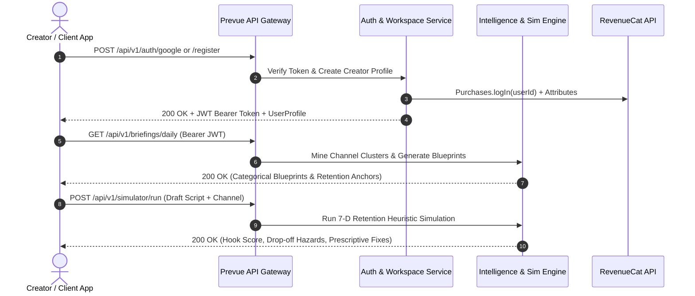

# Prevue Creator Intelligence — Backend REST API Specification

**Version:** 1.0.0  
**Base URL:** `https://api.prevue.studio/api/v1` (Production) / `http://localhost:8080/api/v1` (Development)  
**Security Scheme:** HTTP Bearer JWT Authentication (`Authorization: Bearer <token>`)  
**Data Format:** JSON (`Content-Type: application/json; charset=utf-8`)

---

## 📑 Overview & Architecture

Prevue's backend powers YouTube Data API mining, semantic topic demand clustering, Gemini 1.5/2.0 AI blueprint generation, 30-second retention simulation, and RevenueCat subscription webhook sync.



---

## 🔐 1. Authentication Endpoints

### 1.1 Register Creator Account
* **Endpoint:** `POST /api/v1/auth/register`
* **Description:** Creates a new creator account, assigns initial YouTube handle, and provisions a secure `app_user_id` for RevenueCat.

#### Request Body
```json
{
  "email": "creator@studio.io",
  "password": "SecurePassword123!",
  "displayName": "Alex Rivera",
  "initialHandle": "@RevenueCat"
}
```

#### Response `201 Created`
```json
{
  "success": true,
  "token": "eyJhbGciOiJIUzI1NiIsInR5cCI6IkpXVCJ9...",
  "user": {
    "id": "usr_reg_1788060481234",
    "email": "creator@studio.io",
    "displayName": "Alex Rivera",
    "photoUrl": null,
    "connectedChannels": ["@RevenueCat"],
    "activeChannelHandle": "@RevenueCat",
    "isPro": false,
    "createdAt": "2026-08-30T09:20:00Z"
  }
}
```

---

### 1.2 Sign In with Email
* **Endpoint:** `POST /api/v1/auth/login`
* **Description:** Authenticates email and password credentials, returning a JWT token and user profile.

#### Request Body
```json
{
  "email": "creator@studio.io",
  "password": "SecurePassword123!"
}
```

#### Response `200 OK`
```json
{
  "success": true,
  "token": "eyJhbGciOiJIUzI1NiIsInR5cCI6IkpXVCJ9...",
  "user": {
    "id": "usr_reg_1788060481234",
    "email": "creator@studio.io",
    "displayName": "Alex Rivera",
    "photoUrl": null,
    "connectedChannels": ["@RevenueCat"],
    "activeChannelHandle": "@RevenueCat",
    "isPro": false,
    "createdAt": "2026-08-30T09:20:00Z"
  }
}
```

---

### 1.3 1-Tap Google OAuth
* **Endpoint:** `POST /api/v1/auth/google`
* **Description:** Authenticates via Google ID Token or Google OAuth authorization code.

#### Request Body
```json
{
  "idToken": "google_oauth_id_token_xyz...",
  "preferredHandle": "@RevenueCat"
}
```

#### Response `200 OK`
```json
{
  "success": true,
  "token": "eyJhbGciOiJIUzI1NiIsInR5cCI6IkpXVCJ9...",
  "user": {
    "id": "usr_google_1788060485678",
    "email": "alex.rivera@gmail.com",
    "displayName": "Alex Rivera",
    "photoUrl": "https://images.unsplash.com/photo-1534528741775-53994a69daeb?w=150",
    "connectedChannels": ["@RevenueCat"],
    "activeChannelHandle": "@RevenueCat",
    "isPro": true,
    "createdAt": "2026-08-30T09:20:00Z"
  }
}
```

---

## 👤 2. User & Multi-Channel Workspace Endpoints

### 2.1 Get Current Profile
* **Endpoint:** `GET /api/v1/user/profile`
* **Headers:** `Authorization: Bearer <token>`

#### Response `200 OK`
```json
{
  "success": true,
  "user": {
    "id": "usr_google_1788060485678",
    "email": "alex.rivera@gmail.com",
    "displayName": "Alex Rivera",
    "photoUrl": "https://images.unsplash.com/photo-1534528741775-53994a69daeb?w=150",
    "connectedChannels": ["@RevenueCat", "@Telusko", "@Fireship"],
    "activeChannelHandle": "@RevenueCat",
    "isPro": true,
    "simulationsUsedThisMonth": 1,
    "simulationsLimit": 999999
  }
}
```

---

### 2.2 Add Connected YouTube Channel (Multi-Channel Workspace)
* **Endpoint:** `POST /api/v1/user/channels`
* **Headers:** `Authorization: Bearer <token>`
* **Rules:** Free tier is restricted to 1 channel. Adding >1 channel returns `403 Forbidden` if `isPro == false`.

#### Request Body
```json
{
  "handle": "@Fireship"
}
```

#### Response `200 OK`
```json
{
  "success": true,
  "connectedChannels": ["@RevenueCat", "@Fireship"],
  "activeChannelHandle": "@Fireship"
}
```

#### Response `403 Forbidden` (When Free user attempts multi-channel)
```json
{
  "success": false,
  "error": "PRO_REQUIRED",
  "message": "Multi-channel workspace requires an active Creator Pro subscription."
}
```

---

### 2.3 Switch Active Workspace Channel
* **Endpoint:** `POST /api/v1/user/channels/active`
* **Headers:** `Authorization: Bearer <token>`

#### Request Body
```json
{
  "handle": "@Telusko"
}
```

#### Response `200 OK`
```json
{
  "success": true,
  "activeChannelHandle": "@Telusko"
}
```

---

## 💡 3. Prescriptive Briefings & Creator Intelligence

### 3.1 Get Daily Prescriptive Blueprints
* **Endpoint:** `GET /api/v1/briefings/daily`
* **Headers:** `Authorization: Bearer <token>`
* **Query Params:** `handle=@RevenueCat` (optional, defaults to active channel)

#### Response `200 OK`
```json
{
  "success": true,
  "channel": {
    "channelName": "RevenueCat",
    "handle": "@RevenueCat",
    "subscribers": 14200,
    "medianViews": 5600,
    "topTopicClusters": ["In-App Subscriptions", "Paywall Optimization", "App Churn"]
  },
  "blueprints": [
    {
      "id": "bp_01",
      "title": "Why 90% of In-App Subscriptions Fail in Month 1",
      "format": "longForm",
      "formatLabel": "Long-Form (12–15 Min)",
      "hookText": "If your subscription app has higher than 15% churn in week 1, you have a paywall onboarding gap...",
      "thumbnailConceptLeft": "Churn Graph Spiking",
      "thumbnailConceptRight": "Retention Framework with Verified Badge",
      "thumbnailTag": "RETENTION BENCHMARK",
      "dataProofReason": "Derived from live subscriber telemetry benchmarks.",
      "predictedMultiplier": 3.2,
      "convictionScore": 9.1,
      "categoryTag": "Subscription App Growth",
      "preEngineeredRetentionAnchors": [
        "0:00 - 0:05: High-tension hook",
        "0:05 - 0:25: Immediate benchmark proof",
        "0:25 - 4:00: Step-by-step framework",
        "End: Next video bridge"
      ]
    }
  ]
}
```

---

## ⚡ 4. Pre-Flight Simulator Engine

### 4.1 Run Script Simulation
* **Endpoint:** `POST /api/v1/simulator/run`
* **Headers:** `Authorization: Bearer <token>`

#### Request Body
```json
{
  "title": "I Built My Entire Stack With AI Agents",
  "draftScript": "Today I am going to explain how AI agents work. We tried building an autonomous pipeline for 30 days and benchmarked the speed.",
  "format": "longForm",
  "channelHandle": "@RevenueCat"
}
```

#### Response `200 OK`
```json
{
  "success": true,
  "simulationResult": {
    "id": "sim_res_1788060500123",
    "hookScore": 7.8,
    "resonanceScore": 8.4,
    "noveltyScore": 8.0,
    "topicMomentumScore": 8.9,
    "clarityScore": 8.2,
    "pacingScore": 7.5,
    "creatorFitScore": 8.6,
    "overallScore": 8.2,
    "projectedViewsMultiplier": 2.4,
    "projectedViews": 13440,
    "hazards": [
      {
        "timestamp": "0:04",
        "severity": "high",
        "sentence": "Today I am going to explain how AI agents work.",
        "issue": "Passive introductory framing causing early viewer drop-off."
      }
    ],
    "fixes": [
      {
        "id": "fix_01",
        "title": "Aggressive Visual Hook",
        "description": "Replace generic intro with immediate benchmark proof.",
        "scoreLift": 1.2,
        "isApplied": false
      }
    ]
  }
}
```

---

## 💳 5. RevenueCat Webhook Synchronization

### 5.1 RevenueCat Event Webhook
* **Endpoint:** `POST /api/v1/webhooks/revenuecat`
* **Headers:** `Authorization: Bearer <rc_webhook_auth_secret>`
* **Description:** Receives live subscription lifecycle events (`INITIAL_PURCHASE`, `RENEWAL`, `CANCELLATION`, `EXPIRATION`) and syncs user Pro entitlement status in the database.

#### Payload Example
```json
{
  "event": {
    "type": "INITIAL_PURCHASE",
    "app_user_id": "usr_google_1788060485678",
    "product_id": "creator_pro_annual",
    "entitlement_ids": ["creator_pro_access"],
    "purchased_at_ms": 1788060500000,
    "expiration_at_ms": 1819596500000
  }
}
```

#### Response `200 OK`
```json
{
  "received": true,
  "user_id": "usr_google_1788060485678",
  "entitlement": "creator_pro_access",
  "status": "active"
}
```

---

## 📊 Error Code Reference Table

| HTTP Status | Error Code | Description |
| :--- | :--- | :--- |
| **`400 Bad Request`** | `INVALID_PAYLOAD` | Missing required fields or malformed request payload. |
| **`401 Unauthorized`** | `TOKEN_EXPIRED` / `UNAUTHORIZED` | Missing, invalid, or expired JWT token. |
| **`403 Forbidden`** | `PRO_REQUIRED` | Attempted action exceeds Free tier limits (e.g. adding 2nd channel or 4th simulation). |
| **`404 Not Found`** | `CHANNEL_NOT_FOUND` | Specified YouTube handle does not exist or has no public uploads. |
| **`429 Too Many Requests`** | `RATE_LIMIT_EXCEEDED` | Request rate limit exceeded. |
| **`500 Internal Server Error`** | `INTERNAL_ERROR` | An unexpected server-side error occurred. |
