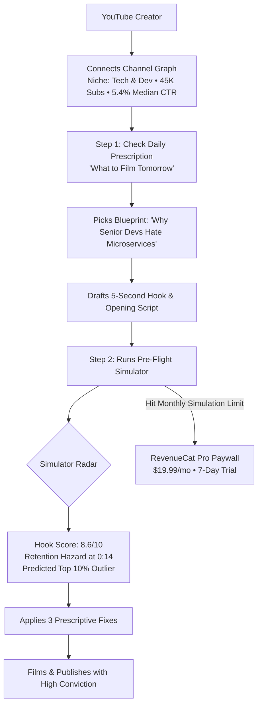
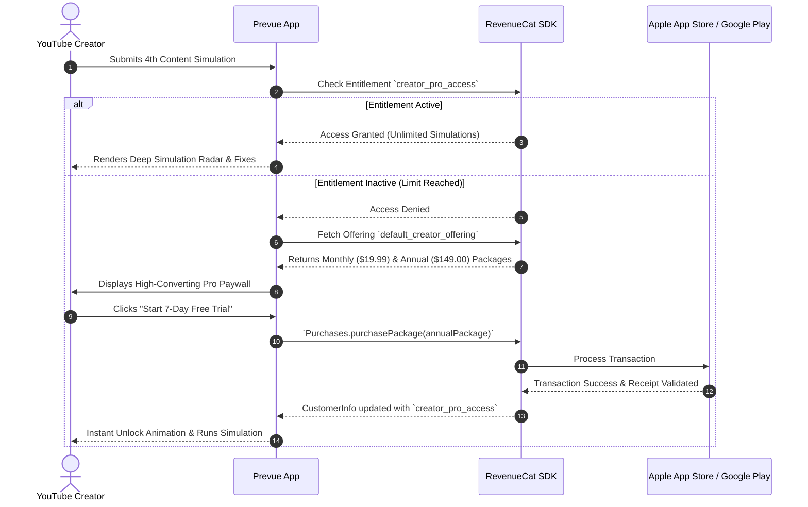
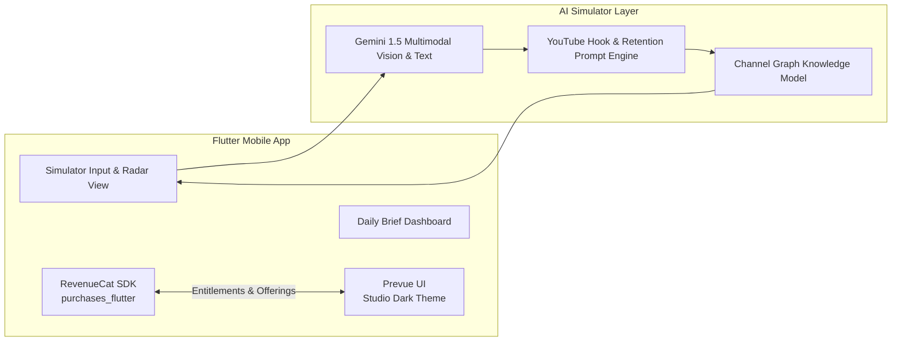

# Product Requirements Document (PRD)
## Project: Prevue (YouTube Creator Intelligence & Pre-Flight Simulator)
**Category:** Creator Economy / AI Intelligence / B2C SaaS  
**Target Award:** Best RevenueCat Integration / Shipathon Hackathon  
**Target Platform:** YouTube (Long-form & Shorts)  
**Version:** 1.0.0 (Lean MVP)  
**Status:** In Development  

---

## 1. Executive Summary & Vision

### 1.1 Vision Statement
To eliminate creative guesswork and wasted production hours for YouTube creators by replacing fragmented, post-publication analytics with **Pre-Flight Intelligence**—telling creators exactly *what to make next* and *simulating video performance before they hit record*.

### 1.2 The Core Problem
1. **The Fragmented Creator Stack:** Creators bounce across 7+ disconnected tools (ChatGPT for ideas, Perplexity for research, CapCut for editing, YouTube Studio for analytics). None of these tools answer the single most critical question: *"Given my audience and historical performance, what should I film tomorrow?"*
2. **Post-Mortem Analytics vs. Pre-Flight Prediction:** Existing YouTube analytics (YouTube Studio, VidIQ, TubeBuddy) only tell creators *why a video flopped after they spent 15 hours filming and editing*. There is no pre-publication simulator to stress-test titles, hooks, and retention drop-offs *before* production.
3. **The Blank-Page Paralysis:** Creators rely on generic AI idea generators that suggest uninspired listicles with zero connection to their channel's proprietary audience resonance or historical retention curves.

### 1.3 The Solution: Prevue
A mobile-first intelligence platform tailored exclusively for YouTube creators:
* **Feature 1: Daily Prescriptive Briefing ("What to Film Tomorrow")** — High-conviction video blueprints backed by proprietary channel data reasons.
* **Feature 2: Pre-Flight Content Simulator ("Will this work?")** — Instant pre-publication stress test calculating Hook Score (0–10), 30-second Retention Hazard, and 3 prescriptive fixes before filming.
* **Monetization Engine (RevenueCat):** Freemium model converting creators into **Creator Pro (\$19.99/mo or \$149/yr)** subscribers for unlimited pre-flight simulations and deep script optimization.

---

## 2. Target Personas & User Journeys

### Persona: The Solo YouTube Creator ("Marcus")
* **Channel:** Tech & Coding (45K subscribers, publishes 1 long-form video + 2 Shorts weekly).
* **Pain Points:** Spends 12 hours researching and editing videos that sometimes flop with a 2.5% CTR; struggles to know which topics his existing subscribers actually crave.
* **Journey with Prevue:**
  1. Opens the app on Monday morning $\rightarrow$ receives 1 high-conviction video prescription with verified audience proof (*"Your last 2 videos on system architecture generated 3.4× median subscribers"*).
  2. Writes a draft hook and inputs it into the **Pre-Flight Simulator**.
  3. Simulator warns of a **Retention Hazard at 0:14** due to slow exposition.
  4. App suggests a tighter 1-line re-hook $\rightarrow$ Score jumps from 6.8 to 8.9.
  5. Marcus hits his free limit and upgrades to **Creator Pro (\$19.99/mo)** via RevenueCat to simulate all weekly scripts.

---

## 3. Product Scope & MVP Feature Specifications

### 3.1 Feature Matrix (YouTube-Only Lean MVP)

| Module | Priority | Description | Target User Value |
| :--- | :---: | :--- | :--- |
| **YouTube Channel Graph Lite** | **P0 (MVP)** | Configurable channel baseline profile (Niche, Audience Persona, Median Views, Median CTR, Top Formats). | Context engine for all AI simulations. |
| **Daily Prescriptive Briefing** | **P0 (MVP)** | 1 Daily high-conviction video/Short blueprint with Title, Hook, Thumbnail Concept, and Data-Backed "Why". | Solves the "What do I make next?" paralysis. |
| **Pre-Flight Content Simulator** | **P0 (MVP)** | Multi-factor analysis of Title + Hook/Script: Hook Score (0–10), Audience Resonance, Retention Hazard Alert, and Predicted Percentile. | Prevents 15 hours wasted on flop videos. |
| **3 Prescriptive Fixes Engine** | **P0 (MVP)** | Actionable, 1-click improvements to titles and script lines to boost retention before recording. | Immediate optimization before hitting record. |
| **RevenueCat Pro Paywall & Entitlements** | **P0 (MVP)** | In-app subscription managing `creator_pro_access`, monthly/annual packages, free trial, and restore purchases. | Sustainable B2C SaaS monetization. |
| **Script Re-Hooker AI** | **P1** | 1-Click generative re-write of opening 30 seconds into 3 viral hook styles (Curiosity Gap, High Stakes, Bold Contrast). | Post-MVP enhancement. |

---

## 4. Detailed Feature Specifications

### 4.1 Feature 1: "What to Film Tomorrow" (Daily Prescription)
* **Input:** Channel Graph data (Niche: e.g., Tech/Programming, Audience Level: 0–3 YOE, Top Topic Clusters).
* **Output Card Structure:**
  * 🏷️ **Format Badge:** `Long-Form (8–10 Min)` or `YouTube Short (35–50s)`
  * 🎯 **Topic & Working Title:** *"Why Junior Devs Get Rejected in 6 Seconds (And the ATS Fix)"*
  * 🪝 **Pre-Engineered 5-Second Hook:** *"Your resume isn't the reason you're not getting interviews. It's this single line in your portfolio."*
  * 🖼️ **Thumbnail Concept:** High-contrast split screen: Red "Rejected" stamp vs. Green 1-line code fix.
  * 📊 **Data-Backed Proof ("The Why"):** *"Job hunting videos generated 2.8× your channel median saves. 48 recent comments requested resume teardowns."*

### 4.2 Feature 2: Pre-Flight Content Simulator ("Will this work?")
* **Input:** Draft Title + Hook (First 30 seconds of script or bullet points) + Target Format.
* **AI Evaluation Pipeline:**
  1. **Hook Strength Score (0–10):** Measures curiosity gap, speed to value, and cognitive load in the first 5 seconds.
  2. **Audience Resonance (0–10):** Measures alignment with the channel's target demographic interest graph.
  3. **30-Second Retention Hazard Alert:** Flags specific timestamps where viewers are at high risk of dropping off (e.g., *"0:12–0:17: Explanatory lull before payoff"*).
  4. **Projected Performance Tier:**
     * 🚀 `Top 10% Channel Outlier (Est. 3.0×+ Median Views)`
     * 🟢 `Above Median (Est. 1.3×–2.0× Median Views)`
     * 🟡 `Average Baseline (Est. 0.8×–1.1× Median Views)`
     * 🔴 `High Flop Risk (<0.5× Median Views)`
  5. **3 Prescriptive Fixes:**
     * *Fix 1:* Title keyword optimization for search/browse algorithm.
     * *Fix 2:* Script cut to eliminate introductory fluff.
     * *Fix 3:* Pacing/visual pattern interrupt suggestion.

---

## 5. RevenueCat Monetization & Entitlement Architecture

### 5.1 Pricing & Tiering Strategy

| Tier | Price | Features Included |
| :--- | :--- | :--- |
| **Free Creator** | **\$0 / free forever** | • 1 Daily Prescriptive Video Blueprint • 3 Pre-Flight Content Simulations / month • Basic Hook Score |
| **Creator Pro** | **\$19.99 / month** or **\$149 / year** (Save 38%) | • **Unlimited** Pre-Flight Video & Short Simulations • 30-Second Retention Hazard Timeline • 3 Prescriptive AI Fixes & Re-Hooker • Historical Channel Outlier Predictor • 7-Day Free Trial |

---

## 6. Technical Architecture & Tech Stack

### Tech Stack Details
* **Framework:** Flutter 3.x (iOS & Android cross-platform in `D:\UdayData\Projects\shipathon_hackathon`).
* **In-App Subscriptions:** `purchases_flutter` (RevenueCat SDK 10.x).
* **Design & Typography:** Google Fonts (Plus Jakarta Sans / Inter), Studio Dark Aesthetic (`#0F172A`, `#1E293B`, `#2563EB`, `#10B981`, `#EF4444`).
* **State Management:** `provider` (Clean separation of Simulation state, Channel profile state, and RevenueCat subscription state).

---

## 7. Success Metrics & Hackathon Criteria

| Metric | Target Goal | Value Justification |
| :--- | :--- | :--- |
| **Time to First Value** | $< 30$ seconds | Creator opens app, pastes draft title, and gets immediate score & fixes. |
| **Simulation to Pro Conversion** | $> 12\%$ | High perceived ROI: \$19.99/mo is trivial compared to saving 15 hours on a flop video. |
| **Retention Lift** | $+18–25\%$ | Prescriptive intro cuts reliably eliminate early 30-second viewer drop-off. |

---

## 8. Summary & Execution Status
This PRD outlines the lean, high-impact YouTube MVP for **Prevue**. The scope is strictly bounded to the two highest-conviction features (Daily Prescription + Pre-Flight Simulator) with seamless RevenueCat subscription integration.
